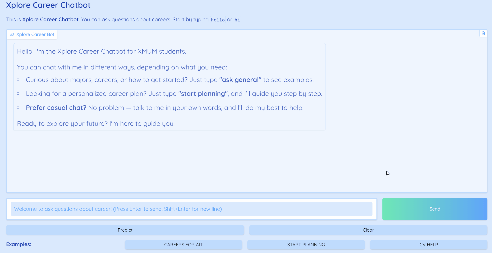

# 🚀 XploreCareer-Chatbot  
*A specialized career advisor for Xiamen University Malaysia (XMUM) students*  
## Overview  
AI-powered chatbot helps XMUM students discover personalized career paths through conversation analysis and psychological profiling.  

## Key Features  
### Smart Chat Interaction  
- Natural text-based conversations about career questions  
- *Expert MBTI Assessment*: Personality evaluation using rule-based expert systems  
- Dynamic responses tailored to user inputs  
### AI-Powered Career Prediction  
- **NLP-Driven Analysis**: Keyword extraction from conversations. Career suitability prediction with probability scoring  
- **Visual Analytics**: Probability graphs for recommended career paths

## Demonstration  


## How to Setup:
### Prerequisites:
#### Ollama client with Phi4-mini: Get from https://ollama.com/
After installed the Ollama client, run:
```
ollama pull phi4-mini
```
#### Python packages:
```
pip install gradio aiml nltk sentence_transformers matplotlib
```
or
```
pip install -r requirements.txt
```
### If you have trouble:
```
AttributeError: module 'time' has no attribute 'clock'
```
#### Goto \Lib\site-packages\aiml\Kernel.py
#### Replace all **time.clock()** to **time.perf_counter()**